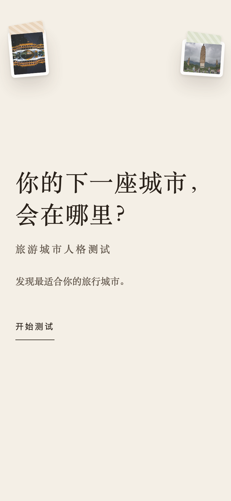
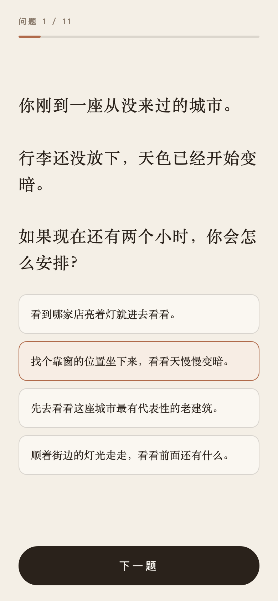
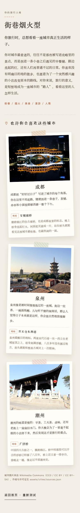

# 旅游城市人格测试

> 你的下一座城市，会在哪里？

11 道题的旅行人格测试：答完之后，从 **S / R / H / E** 四种旅行人格里找出你的那一种，
并推荐 3 座最适合你的城市，附上每座城市的地标介绍。

原生 HTML + CSS + JavaScript，**没有任何依赖、没有构建步骤**，一个文件夹就能跑，
也可以直接丢到 GitHub Pages 上。

<p align="center">
  
  
</p>

<p align="center">
  <em>手机端是一屏一题的竖屏体验：顶部进度条、中间题目可滚动、底部固定的大按钮。</em>
</p>



## 四种旅行人格

| 类型 | 人格 | 推荐城市 | 地标 |
| :--: | --- | --- | --- |
| **S** | 街巷烟火型 | 成都 · 泉州 · 潮州 | 安顺廊桥 · 开元寺东西塔 · 广济桥 |
| **R** | 山海松弛型 | 大理 · 威海 · 建德 | 崇圣寺三塔 · 刘公岛 · 梅城古镇（严州古城） |
| **H** | 历史审美型 | 西安 · 景德镇 · 大同 | 西安钟楼 · 御窑博物馆 · 悬空寺 |
| **E** | 异域探索型 | 西双版纳 · 伊宁 · 喀什 | 景真八角亭 · 拜图拉清真寺 · 艾提尕尔清真寺 |

## 特点

- **一屏一题**：手机上每道题正好占满一屏，`下一题` 按钮固定在拇指位置，不会被长题干挤出屏幕。
- **手账 / 明信片风格**：城市卡片用 CSS 做了纸胶带、轻微旋转和投影，像贴在本子上的照片。
- **响应式**：桌面端城市卡片三列并排，手机端自动变成一列。
- **可安装（PWA）**：手机上「添加到主屏幕」后可以全屏打开、离线使用，清单里已声明竖屏方向。
- **无依赖**：不打包、不需要 npm，改完直接刷新就能看到。

## 本地运行

直接用浏览器打开 `index.html` 就能用。

如果想验证 PWA / Service Worker，需要通过一个本地服务器打开（浏览器不允许 `file://` 注册 Service Worker）：

```bash
python3 -m http.server 8000
```

然后访问 <http://localhost:8000>。

> 直接双击打开 `index.html`（`file://`）时，控制台会出现一条
> `manifest.webmanifest ... blocked by CORS policy` 的提示。
> 这是浏览器对本地文件的限制，不是页面错误 —— 用上面的本地服务器打开，
> 或者部署到 GitHub Pages 之后，控制台是干净的。

## 部署到 GitHub Pages

1. 把仓库推到 GitHub。
2. 打开仓库的 **Settings → Pages**。
3. **Source** 选择 `Deploy from a branch`。
4. **Branch** 选择 `main`，目录选择 `/ (root)`，点 **Save**。
5. 等一两分钟，访问 `https://<你的用户名>.github.io/<仓库名>/`。

仓库里的 `.nojekyll` 会让 GitHub Pages 跳过 Jekyll 处理，避免静态文件被误改。

> 小提示：`index.html` 里的 `og:image` 目前写的是相对路径。部署之后，
> 建议把它换成完整网址（`https://<你的用户名>.github.io/<仓库名>/assets/screenshots/og.png`），
> 这样分享到群里或社交平台时才有配图。

## 项目结构

```
.
├── index.html                 # 页面结构（首页 / 答题页 / 结果页容器）
├── style.css                  # 全部样式，含桌面、平板、手机竖屏三套规则
├── script.js                  # 题库、评分规则、四种人格、交互逻辑
├── manifest.webmanifest       # PWA 清单（名称、图标、竖屏、主题色）
├── sw.js                      # Service Worker，用于离线打开
├── .nojekyll                  # GitHub Pages 跳过 Jekyll
├── LICENSE                    # MIT（仅代码，不含图片）
└── assets/
    ├── cities/                # 12 张城市照片 + sources.json
    ├── icons/                 # 应用图标（favicon / apple-touch-icon / 192 / 512）
    └── screenshots/           # README 用的截图与分享图
```

## 想改内容的话，改哪里

全部集中在 `script.js` 顶部的三个数据块，改完刷新即可：

| 想改什么 | 位置 |
| --- | --- |
| 题目和选项 | `questions` |
| 每个选项对应的人格加分 | `scoring` |
| 四种人格的名称、描述、keywords、推荐城市与地标介绍 | `personalities` |

每个城市对象长这样：

```js
{
    name: "成都",
    image: "assets/cities/chengdu.jpg",
    landmark: "安顺廊桥",
    note: "这座城市为什么和这个旅行人格合得来……",
    landmarkNote: "地标建筑的一句话介绍……"
}
```

换掉 `assets/cities/` 里的图片时，记得同步更新 `image` 路径和 `sources.json`。

改了网页内容之后，如果要让已经装到手机上的版本也更新，
把 `sw.js` 里的 `CACHE_VERSION` 从 `v1` 往上加一即可。

## 图片来源与许可

`assets/cities/` 下的 12 张城市照片全部来自 [Wikimedia Commons](https://commons.wikimedia.org/)，
均为可自由使用的授权（CC0 / CC BY / CC BY-SA），**未使用任何付费图库或来源不明的图片**。
每张图的原始页面、作者、许可证和下载文件名记录在
[`assets/cities/sources.json`](assets/cities/sources.json)。

如果要把本项目再发布或商用，请保留这些署名信息。

## License

代码部分使用 [MIT License](LICENSE)。
`assets/cities/` 下的图片不适用 MIT，各自遵循其 Creative Commons 授权。
